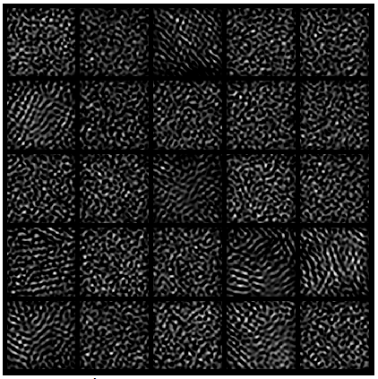
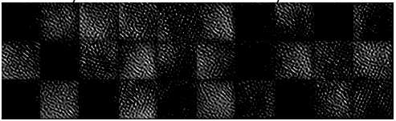

# Material-Design-CDBN
# Microstructure Representation and Reconstruction of Heterogeneous Materials via Deep Belief Network for Computational Material Design
## Ruijin Cang, Max Yi Ren
Full paper here: [https://arxiv.org/abs/1612.07401](https://arxiv.org/abs/1612.07401)
# Summary of the proposed CDBN
We 
- Set up a 5-layer network consisted by 3 layers of convolutional RBM and 2 fully connected RBM


- The proposed CDBN could reduce the dimension of material microstructure images from 40,000 -> 30.
- The network can reconstruct random microstructures with properties statistically similar to the original samples.

# Sample of Original Images and Random Reconstructions
top row are four different original material microstructures samples and bottom row is their corresponded random reconstructions


## Filters extracted from each layer(take Ti-6Al-4V as an example)
1st layer:


2nd layer:


3rd layer:


4th layer:



5th layer:



note: It is worth noting that the visualizations from the 5th layer include images of almost all black, which is because the output images from these filters have almost uniform pixel values, appearing to be zeros after normalization. 
Also note that these filters are non-trivial, as the effect of activating multiple nodes at the output layer has nonlinear effect in the input space, i.e., the reconstructed image is not a simple addition of filter visualizations, because of the sigmoid operations throughout the network.

Such as the image shown below:


## Critical Fracture Strength Comparison
We compared calcuated the fracture strength for the four different material micrsotrcuture based on three different process: original images,
original reconstructions and random reconstructions. We could see overall they're very similiar statistically(image on the left), but individually
(original compares to the original reconstruction) they're still very different, which is becuase during the training some details are lost
so that we could not reconstruct the original images with the extracted features as shown below:


 

# Impelementation Notice:
To have the result shown in the paper, please run the 'scripts.m' and follow the instruction in the code.
- To visualize the each layer's filter please:
  * first layer: load the results//weights and visualize the matrix "gather(weight.vishid)"
  * other layers: refer to code:
  ```
  matlab recon_2nd_filter.m; recon_3rd_filter;
  ```
- Use the following code to check reconstruction result(please change the trained weight file accordingly). 

  ```
  matlab 1st layer recon: recon_WB.m(comment the lines for hidstate generation, visualize 'store_test1');
  matlab 2nd layer recon: hid_to_vis_test.m(please change the trained weights accordingly)
  matlab 3rd layer recon: thirdlayer_hid_to_vis_ori.m(please change the trained weights accordingly)
  For 4th and 5th, since they're fully connected please use sigmoid(W*v+bias) to recon it back to 3rd layer and use the above code for the rest of of the steps. Please refer to 'recon_5to1.m'
  ```
  
  
- To check the random reconstruction, the process is similar to the above, but to change the '5th layer hidstate' to randomly generated binary vector(size(1,30) in the default setting). Note for different training samples, the sparsity is different, so the randomly generated binary vector should be adjusted based on that.

  ```
  matlab 'recon_5to1.m';
  ```
- For microsture Ti-6Al-4V, post-processing is required. One thing to be noticed: for Ti-6Al-4V, recon back to 3rd layer is always overly saturated. The slightly activated nodes in the 3rd layer across its 288 channels lead to regions in the input layer with overlapped grain boundaries (as black pixels) and such regions are undesirably visualized as voids. Through experiments, we found that thresholding the activations of the 3rd layer at $\tau=0.5$ achieves the lowest average reconstruction error from the original Ti64 samples as shown below. as shown in the following plot:

  ```
  matlab recon_5to1.m(line 27,thresholding);
  python Post-Process(Skeletonization).ipynb for skeletonization
  ```


# Acknoledge:
Thanks to
- Dr. **Honglak Lee**(UMich), Dr. **Kihyuk Sohn**(UMich/NEC) and **Ye Liu**(UMich/OSU) on CDBN implementation
- Dr. **Yang Jiao**(ASU), Dr. **Yongmin Liu**(ASU) and **Yaopengxiao Xu**(ASU) on data acquisition, simulation and validation
- Dr. **Wei Chen**(Northwestern), Dr. **Hongyi Xu**(Northwester/Ford) and Dr. **Ramin Bostanabad**(Northwestern) on material synthesis and other valuable discussions. 
